# First Steps

This aims to be a Step by Step Guide for New Users. 

## Download  
Download RetroShare from [here](../user-guide/installation/).

## Install
Install RetroShare on your Computer

## Create new Profile
Start RetroShare to create your Node. 

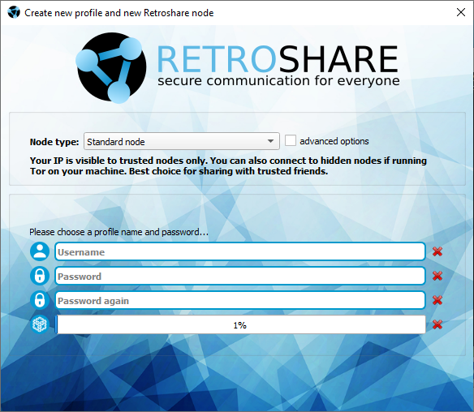  

Enter the values:  

 - Name  
   Name of your Account ([GPG-ID](../user-guide/settings/#public-information)) 
   Visible to your friends, and friends of friends. 
 - Password  
   This password protects your private PGP key. 
   It's wise to choose a long password for your GPG-ID, as this also 
   encrypts your entire RetroShare directory.  
  
Optional: (advanced options)  
 - Node Name ([Location](../user-guide/settings/#public-information))
   Each user can have several Locations were RetroShare is running on 
   different devices with the same [GPG-ID](../user-guide/settings/#public-information). 

 - Chat name  
   Name of your first Identity ([GXS-ID](../user-guide/interface/#pseudonymous-identities)) 
   Used when you write in chat lobbies, forums and channel comments. Can be setup later if you need one. 

Move your mouse to create randomness for the Key creation. 

  

Sign your Certificate by entering your Password.  

  

## First Start  
When you start RetroShare the first time it's empty, because there is no 
content shared by friends. This will change soon with your first connected Friend. 

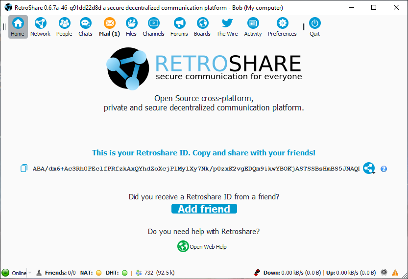  

## Initial Settings
Click on the  Options 
Button to change your  
Network Settings  

  

   ### Nat Settings
   

    
   

   
   Keep your Network Mode at *Public: DHT & Discovery*  
   This will enable DHT and Discovery to improve the connectivity. DHT is 
   also recommended to use, because it provides [Hole Punching](https://en.wikipedia.org/wiki/UDP_hole_punching) 
   and [NAT-PMP](https://en.wikipedia.org/wiki/NAT_Port_Mapping_Protocol) 
   technics to open a port in your firewall. 
   ### Network mode
   

     
   

   
   If your Router is enabling [UPnP](https://en.wikipedia.org/wiki/Universal_Plug_and_Play), 
   keep UPnP. UPnP enables RetroShare to open itself a port on your Router. 
   Otherwise change it to *Manually Forwarded Port* and set a manual Port Forward to your 
   [NAT](../user-guide/settings/#nat) Firewall. For manual Port forward, 
   you can choose your RetroShare port also.  
   ### Upload/download speed
   Set your download and upload speeds to fit your Internet Connection. 
   Keeping this setting below of your total speed is recommended.  
   
For detailed Network Settings explanations click [here](../user-guide/settings/#network)

### Avatar

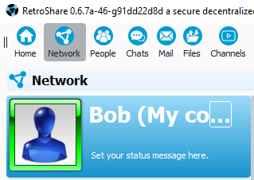  

You may want to change the Avatar of your Location and set a Status message.  

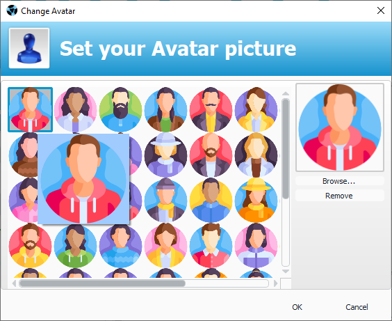  
Click on the avatar to change it.  
 

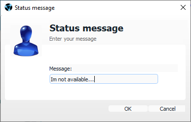  
Click on the message to change it.  

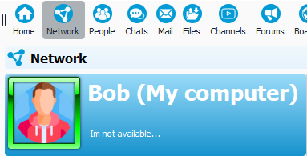  

### Identity
  

RetroShare has already created a first [signed Identity](../user-guide/interface/#pseudonymous-identities) 
for your use in [Chatrooms](../user-guide/interface/#chat-lobbies) 
and [Forums](../user-guide/interface/#forums) and Distant Chats and Mails. 

You may want to create as many additional Identities as well if needed. 

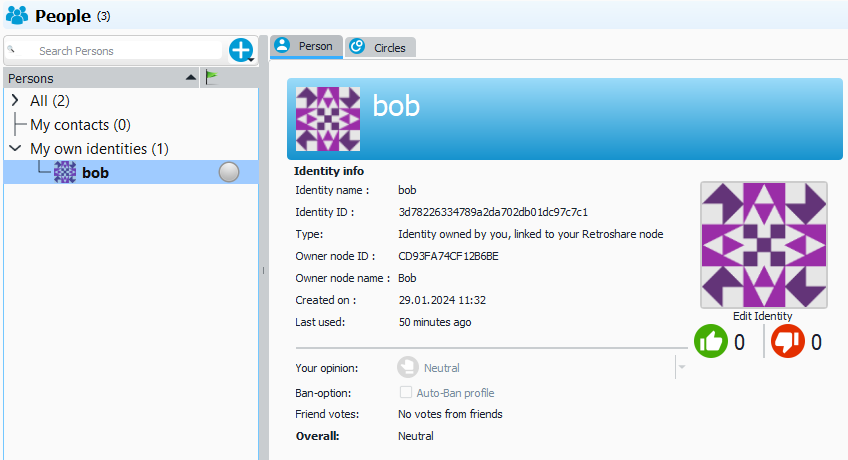 

To change the Avatar of your Identity right click it.  

  

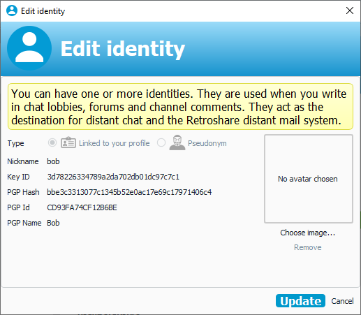  

And change your avatar picture. 

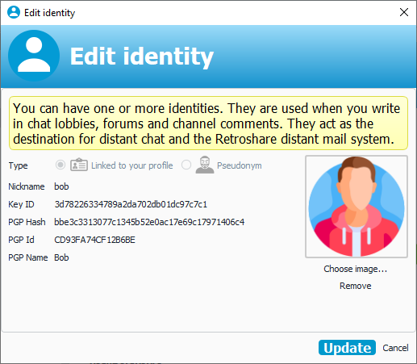  

## First Friend
  

Click on the    Invite Button. 

The fastest way is to exchange the certificates directly with your friends. 
You can also export them to a file and hand them out manually or send it by mail. 

It's important to accept each other vice versa. Your friend must add your 
certificate to his Network/Friendlist. And you need to add the certificate from 
your Friend to your Network/Friendlist.  

 -  copy to clipboard  
 -  save to file  
 -  send by mail  

  

Share your certificate with your friend and request the certificate from 
your Friend.  

Accept your Friend's certificate.  

  

Have a look at the details and finish.

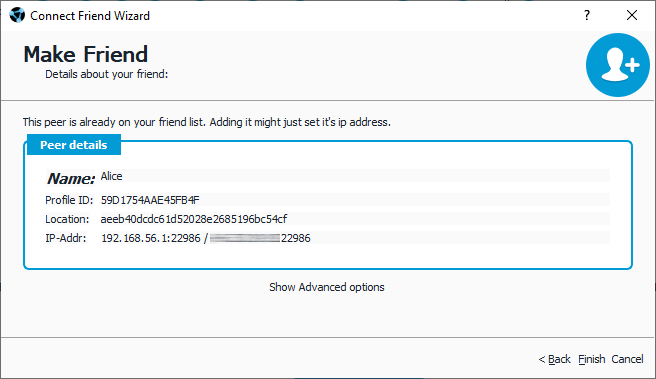  

Connection in Progress, your Node tries to connect to your Friend. 
  

Your connect attempt has been successful, the connection is established. 

  

## First Chat
Your online Contacts(Friend Nodes) will be listed in the Network Tab. 

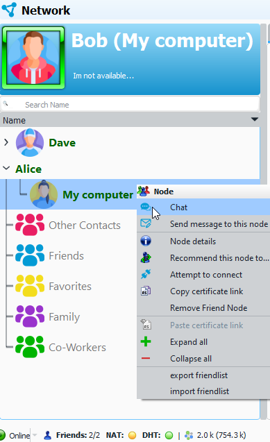
 

Double Clicking will start an instant Chat with your Friends. 

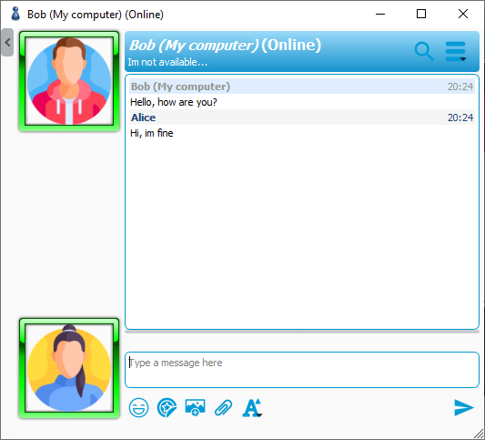  

 
## First Chatroom
Subscribed [Chatrooms](../user-guide/interface/#chat-lobbies) 
from your online friends are shared to you, 
and you are free to subscribe and re-share them as well to your friends.

  

In the same manner  [Forums](../user-guide/interface/#forums), 
 [Channels](../user-guide/interface/#channels), 
 [Posted](../user-guide/interface/#posted) and 
 [File Sharing](../user-guide/interface/#file-sharing) 
will become more and more available per direct 
[Friend-2-Friend](../concept/Friend-2-Friend/#retroshare) 
connections as 
[**your network**](../concept/topology/#retroshare) grows.  
